# SupportCS

> **AI 에이전트가 결합된 멀티테넌트 B2B 고객지원(CS) SaaS 플랫폼**
> 여러 회사(테넌트)가 가입해 자기 고객의 문의를 관리하고, AI 에이전트가 티켓 분류·응답 초안·실시간 상담·업무 처리까지 수행하며, 사람은 검토·승인에 집중합니다.

<!-- 배지 자리: CI / Coverage / License -->

---

## 목차

1. [프로젝트 개요](#1-프로젝트-개요)
2. [핵심 기능](#2-핵심-기능)
3. [시스템 아키텍처](#3-시스템-아키텍처)
4. [서비스 구성](#4-서비스-구성)
5. [서비스 간 통신 설계](#5-서비스-간-통신-설계)
6. [시스템 워크플로우](#6-시스템-워크플로우)
7. [기술 스택](#7-기술-스택)
8. [DevOps / Full Cycle](#8-devops--full-cycle)
9. [구현 스코프](#9-구현-스코프)
10. [레포지토리 구조](#10-레포지토리-구조)
11. [설계 의사결정 기록 (ADR)](#11-설계-의사결정-기록-adr)

---

## 1. 프로젝트 개요

### 문제 정의

업종과 무관하게 모든 회사는 고객 문의를 처리합니다. 그런데 대부분의 CS 조직은 다음 문제를 반복적으로 겪습니다.

| 문제 | 현상 |
|---|---|
| 단순 반복 문의 과다 | 주문 조회, 환불 정책, 계정 문의 등 정형화된 문의가 상담 인력의 대부분을 소모 |
| 분류·배정 지연 | 문의가 들어와도 카테고리·우선순위 판단을 사람이 수동으로 처리 |
| AI 도입의 신뢰 문제 | 챗봇은 "답변"만 할 뿐 실제 업무(환불, 상태 변경)는 못하고, 하더라도 통제·추적이 어려움 |

### 해결 방향

**SupportCS**는 비즈니스 로직과 LLM이 서로의 상태를 주고받으며 협업하는 구조를 지향합니다.

- **AI 없이도 완결된 CS 시스템** — 테넌트·권한·티켓·워크플로우가 순수 비즈니스 로직으로 독립 동작
- **AI는 비즈니스 서비스를 "도구"로 호출** — 조회뿐 아니라 상태 변경 트랜잭션까지 수행
- **모든 AI 액션은 통제·추적 가능** — 위험도 기반 승인 게이트(Human-in-the-loop)와 감사 로그

### 레퍼런스

Zendesk, Intercom(Fin AI), Freshdesk 등 업계 CS 플랫폼이 공통으로 다루는 도메인 패턴(멀티테넌시, 티켓 워크플로우, 상담원 핸드오프)을 직접 설계·구현했습니다.

---

## 2. 핵심 기능

### 비즈니스 기능 (Core)
- **멀티테넌시**: 테넌트(가입 회사)별 데이터 논리 격리, 멤버·부서 관리
- **RBAC**: `OWNER` / `ADMIN` / `AGENT`(상담원) / `VIEWER` 역할 기반 권한
- **티켓 워크플로우**: 생성 → 배정 → 처리 → 해결 → 종결, SLA 기반 우선순위
- **실시간 채팅**: 고객 ↔ AI ↔ 상담원 간 실시간 대화 및 핸드오프

### AI 기능 (Harness)
- **AI 자동 응대**: 실시간 채팅에서 LLM 스트리밍 응답
- **티켓 자동 분류**: 카테고리·우선순위·감정(Sentiment) 판단 및 담당자 추천
- **도구 호출 기반 업무 처리**: AI가 티켓 상태 변경, 고객 정보 조회, 외부 시스템(주문/환불) 호출
- **승인 게이트**: 위험도가 높은 AI 액션은 사람 승인 후 실행
- **응답 초안 생성**: 상담원용 답변 초안 제안

### 거버넌스 / 관측
- **감사 로그**: 사람·AI의 모든 액션을 불변(append-only) 로그로 기록
- **AI 운영 대시보드**: 자동 해결률, 핸드오프율, 평균 응대 시간, LLM 토큰 비용

---

## 3. 시스템 아키텍처

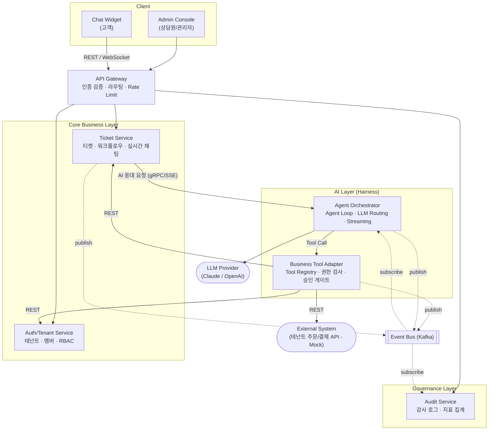

### 아키텍처 원칙

1. **Core는 AI를 모른다** — Core Business 서비스는 AI Layer에 의존하지 않습니다. AI를 떼어내도 CS 시스템은 완전히 동작합니다.
2. **AI는 Adapter를 통해서만 비즈니스에 접근한다** — Agent Orchestrator는 Core 서비스를 직접 호출하지 않습니다. 모든 호출은 Business Tool Adapter의 권한 검사·승인 게이트를 통과합니다.
3. **상태 변경은 이벤트로 전파한다** — 서비스 간 강결합을 피하기 위해 상태 변경은 Kafka 이벤트로 알리고, 필요한 서비스가 구독합니다.

---

## 4. 서비스 구성

| # | 서비스 | 레이어 | 책임 | 소유 데이터 |
|---|---|---|---|---|
| 1 | **API Gateway** | Edge | JWT 검증, 테넌트 컨텍스트 주입, 라우팅, Rate Limit, WebSocket 프록시 | - |
| 2 | **Auth/Tenant Service** | Core | 회원가입·로그인, 토큰 발급, 테넌트·멤버·역할 관리 | `tenants`, `members`, `roles` |
| 3 | **Ticket Service** | Core | 티켓 CRUD, 상태 머신, 배정, SLA, 채팅 세션·메시지 | `tickets`, `ticket_events`, `chat_sessions`, `messages` |
| 4 | **Agent Orchestrator** | AI | Agent Loop(ReAct), 프롬프트 구성, 모델 라우팅, 스트리밍, 토큰/비용 측정 | `agent_runs`, `agent_steps` |
| 5 | **Business Tool Adapter** | AI | Tool 스키마 레지스트리, Tool 실행, 권한 검사, 위험도 판정, 승인 대기열 | `tool_definitions`, `approval_requests` |
| 6 | **Audit Service** | Governance | 전 서비스 이벤트 수집, 불변 감사 로그, 운영 지표 집계 | `audit_logs`, `metrics_daily` |

> **Database per Service** 원칙을 따릅니다. 각 서비스는 자기 DB만 직접 접근하며, 다른 서비스 데이터는 API 또는 이벤트로만 얻습니다.

---

## 5. 서비스 간 통신 설계

### 동기 vs 비동기 기준

| 상황 | 방식 | 이유 |
|---|---|---|
| 클라이언트 요청 처리 | REST (Gateway 경유) | 즉시 응답 필요 |
| AI 응답 스트리밍 | SSE / WebSocket | 토큰 단위 실시간 전달 |
| AI의 Tool 실행 | REST (Adapter → Core) | Tool 결과가 다음 추론 스텝의 입력이므로 동기 필요 |
| 상태 변경 전파 | Kafka 이벤트 | 발행자가 구독자를 몰라도 되도록 결합도 최소화 |
| 감사 로그 기록 | Kafka 이벤트 | 비즈니스 트랜잭션 지연·실패에 영향 주지 않도록 |

### 주요 Kafka 토픽

| 토픽 | 발행 | 구독 | 용도 |
|---|---|---|---|
| `ticket.created` | Ticket | Orchestrator, Audit | 신규 티켓 AI 자동 분류 트리거 |
| `ticket.status-changed` | Ticket | Audit | 상태 변경 이력 |
| `chat.handoff-requested` | Orchestrator | Ticket, Audit | AI → 상담원 핸드오프 |
| `agent.action-executed` | Adapter | Audit | AI가 실행한 Tool 액션 기록 |
| `agent.approval-requested` | Adapter | Ticket, Audit | 승인 필요 액션 알림 |
| `agent.run-completed` | Orchestrator | Audit | 토큰 사용량·비용·소요시간 |

### 이벤트 신뢰성

- **Transactional Outbox 패턴**: DB 커밋과 이벤트 발행의 원자성 보장 (상태는 바뀌었는데 이벤트가 유실되는 문제 방지)
- **멱등 소비자**: `event_id` 기반 중복 처리 방지
- **DLQ**: 재시도 한도 초과 이벤트는 Dead Letter Topic으로 격리

---

## 6. 시스템 워크플로우

### 6.1 인증 및 테넌트 컨텍스트 전파

모든 요청은 Gateway에서 JWT를 검증하고, 테넌트·사용자·역할 정보를 헤더로 주입해 하위 서비스로 전달합니다. 하위 서비스는 이 컨텍스트로 테넌트 격리와 권한 검사를 수행합니다.

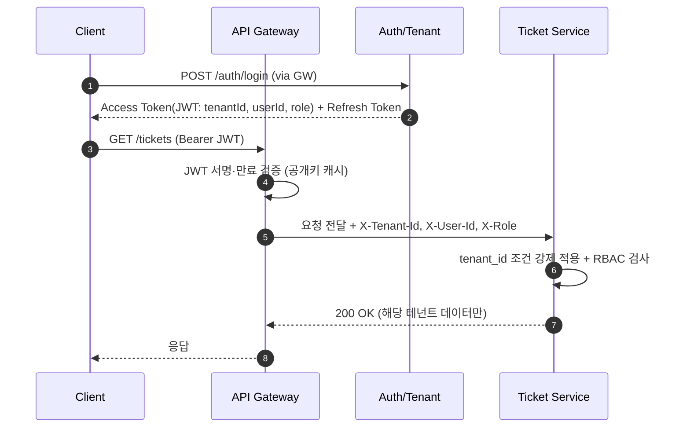

---

### 6.2 실시간 채팅 → AI 응대 → 자동 처리 / 상담원 핸드오프 ⭐ 메인 시나리오

고객이 채팅으로 문의하면 AI가 스트리밍으로 응대하고, 필요하면 Tool을 호출해 실제 업무를 처리합니다. AI가 해결할 수 없거나 확신도가 낮으면 티켓을 생성해 상담원에게 넘깁니다.

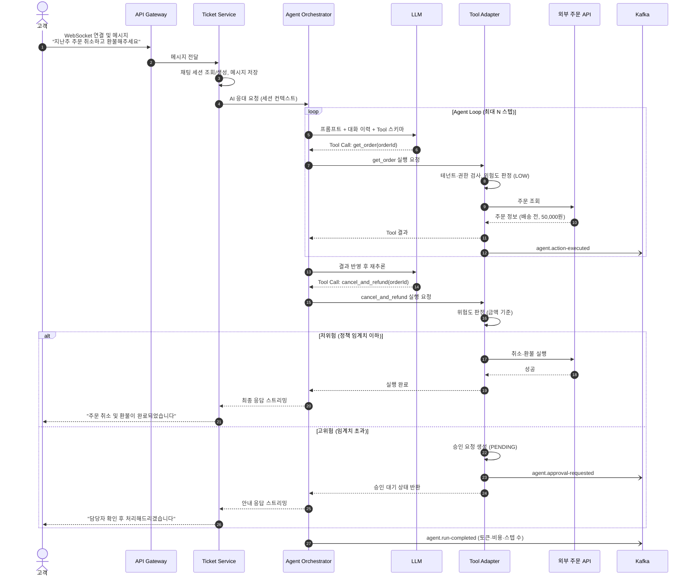

#### 핸드오프 판단 기준

AI는 다음 중 하나라도 해당하면 상담원에게 핸드오프합니다.

- 고객이 상담원 연결을 명시적으로 요청
- 응답 확신도(Self-evaluation score)가 임계치 미만
- Agent Loop 최대 스텝 초과 또는 Tool 반복 실패
- 부정 감정(Sentiment)이 강하게 감지됨
- 해당 의도(Intent)에 대응하는 Tool이 없음

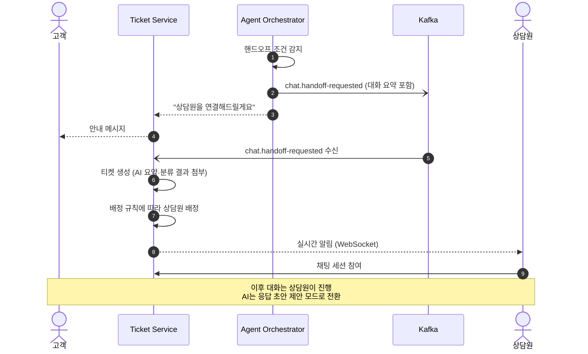

---

### 6.3 이벤트 기반 티켓 자동 분류

이메일·웹폼 등 비실시간 채널로 생성된 티켓은 이벤트를 통해 AI가 비동기로 분류합니다. Ticket Service는 AI의 존재를 모르고 이벤트만 발행합니다.

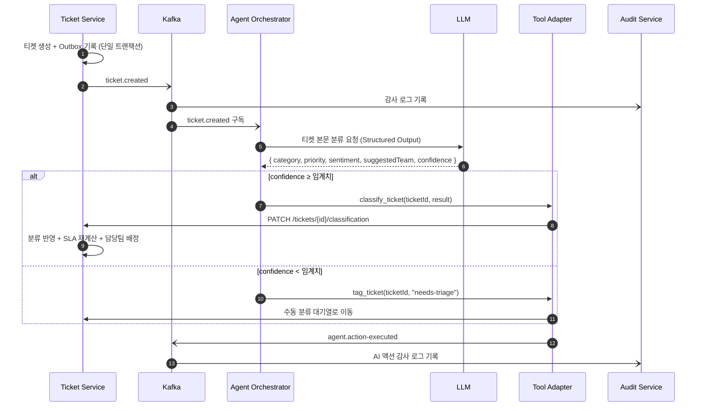

---

### 6.4 Agent Loop (Harness 내부 동작)

Agent Orchestrator의 핵심 실행 엔진입니다. 무한 루프·비용 폭주·장애 전파를 막는 안전장치가 포함됩니다.

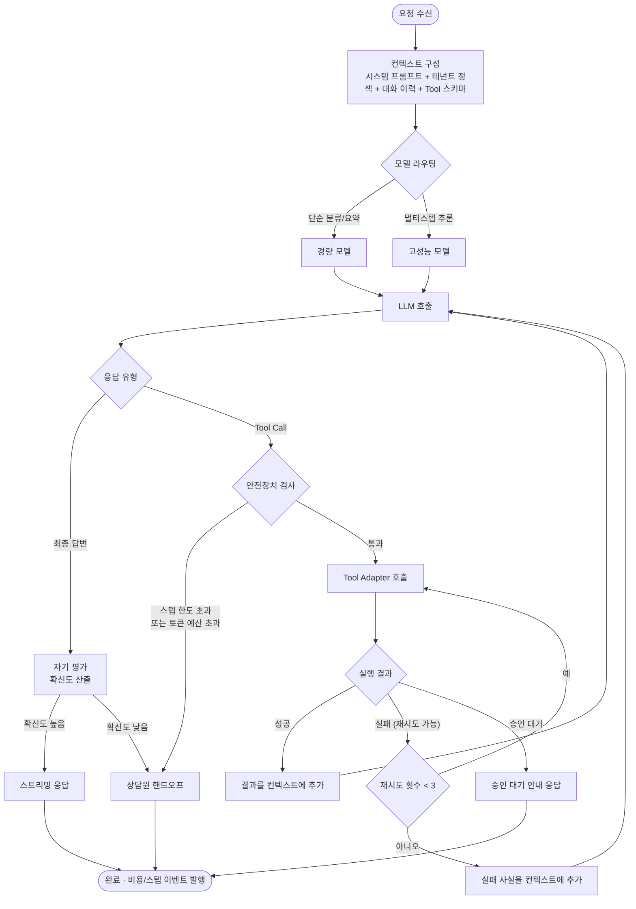

| 안전장치 | 기본값 | 목적 |
|---|---|---|
| 최대 스텝 수 | 8 | 무한 루프 방지 |
| 런당 토큰 예산 | 테넌트 플랜별 설정 | 비용 폭주 방지 |
| Tool 타임아웃 | 5s | 느린 외부 시스템으로 인한 지연 전파 방지 |
| Tool 재시도 | 지수 백오프 3회 | 일시적 장애 대응 |
| 서킷 브레이커 | Tool별 독립 | 특정 Tool 장애가 전체 에이전트로 전파되지 않도록 격리 |
| LLM Fallback | Primary → Secondary 모델 | LLM 제공자 장애 대응 |

---

### 6.5 AI 액션 승인 게이트 (Human-in-the-loop)

모든 Tool은 위험도(`LOW` / `MEDIUM` / `HIGH`)를 가지며, 테넌트 정책과 실행 파라미터(금액 등)에 따라 실행 여부가 결정됩니다.

| 위험도 | 예시 Tool | 처리 |
|---|---|---|
| `LOW` | `get_order`, `search_faq`, `get_customer` | 즉시 실행 |
| `MEDIUM` | `classify_ticket`, `update_ticket_status` | 즉시 실행 + 사후 검토 가능 |
| `HIGH` | `cancel_and_refund`, `issue_coupon`, `close_ticket` | 정책 임계치 초과 시 승인 필수 |

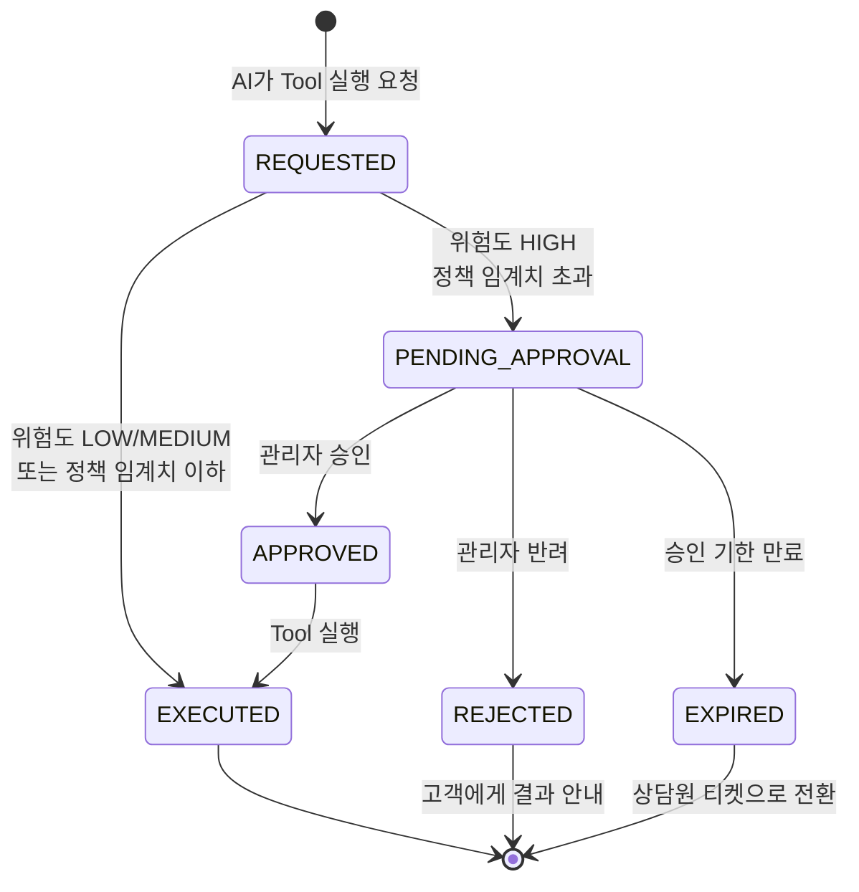

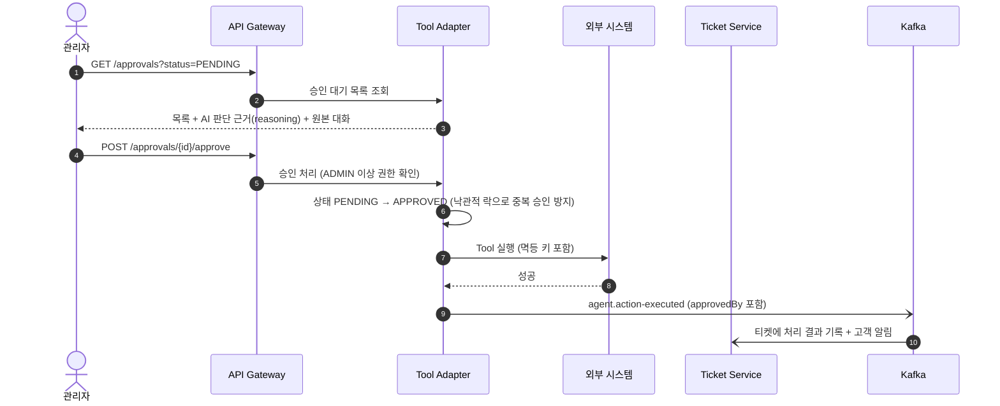

---

### 6.6 티켓 상태 머신

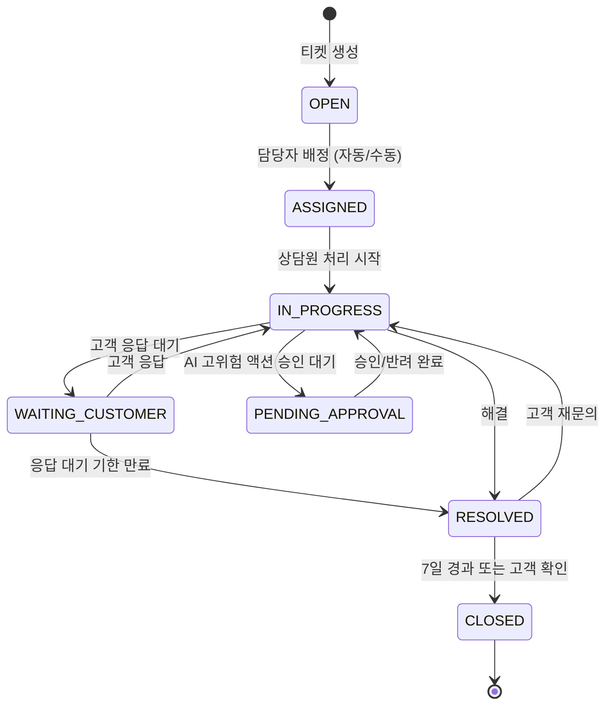

- 상태 전이는 도메인 객체 내부에서만 허용 (허용되지 않은 전이는 예외)
- 모든 전이는 `ticket_events` 테이블에 이력으로 남고 `ticket.status-changed` 이벤트로 발행

---

### 6.7 감사 로그 및 운영 지표 수집

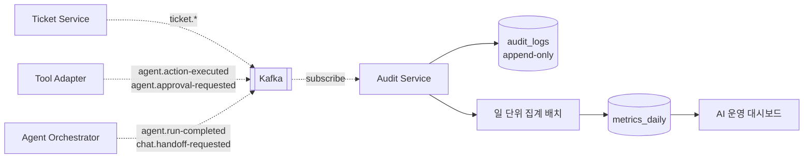

**대시보드 지표**

| 지표 | 정의 |
|---|---|
| AI 자동 해결률 | 핸드오프 없이 종료된 채팅 세션 비율 |
| 핸드오프율 | 상담원에게 이관된 세션 비율 (사유별) |
| 평균 첫 응답 시간 | 문의 수신 → 첫 응답까지 소요 시간 (AI vs 사람) |
| 승인 요청 처리 시간 | 승인 요청 → 승인/반려까지 소요 시간 |
| LLM 비용 | 테넌트별·모델별 토큰 사용량 및 추정 비용 |

---

## 7. 기술 스택

> ⚠️ 초안입니다. 확정 시 ADR로 근거를 남깁니다.

| 영역 | 기술 | 비고 |
|---|---|---|
| Core 백엔드 | Java 21, Spring Boot 3 | Auth/Tenant, Ticket, Tool Adapter, Audit |
| AI 백엔드 | Python, FastAPI | Agent Orchestrator (LLM 생태계 활용) |
| API Gateway | Spring Cloud Gateway | JWT 검증, WebSocket 프록시 |
| 프론트엔드 | React, TypeScript, Next.js | Admin Console + Chat Widget |
| DB | PostgreSQL | 서비스별 독립 DB (스키마 분리) |
| 캐시 / 세션 | Redis | Rate Limit, 채팅 세션 Pub/Sub |
| 메시징 | Apache Kafka | 이벤트 버스 + Outbox |
| 벡터 검색 | pgvector | FAQ/정책 문서 RAG |
| LLM | Claude API, OpenAI API | 모델 라우팅 + Fallback |
| 인프라 | Docker, Kubernetes, Helm, Terraform (AWS) | |
| CI/CD | GitHub Actions, Argo CD | 서비스별 독립 파이프라인, GitOps |
| 관측성 | OpenTelemetry, Prometheus, Grafana, Loki, Tempo | 분산 트레이싱으로 Agent Step 시각화 |
| 테스트 | JUnit5, Testcontainers, pytest, k6 | 통합 테스트 + 부하 테스트 |

---

## 8. DevOps / Full Cycle

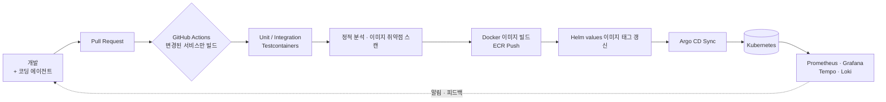

- **IaC**: VPC, EKS, RDS, MSK(Kafka)를 Terraform 모듈로 관리
- **GitOps**: 매니페스트 레포를 단일 진실 공급원으로 사용, Argo CD가 클러스터와 동기화
- **서비스별 독립 배포**: 모노레포 내 경로 필터로 변경된 서비스만 빌드·배포
- **관측성**: 하나의 고객 문의가 Gateway → Ticket → Orchestrator → LLM → Adapter → 외부 시스템을 거치는 전 과정을 단일 Trace로 추적
- **비용 관측**: LLM 호출을 OpenTelemetry Span 속성(모델, 토큰 수, 비용)으로 기록해 Grafana에서 테넌트별 비용 확인
- **로컬 개발**: `docker compose up` 하나로 전체 스택 실행

### 코딩 에이전트 활용

개발 과정 전반에 AI 코딩 에이전트를 활용하며, 그 방식 자체를 문서화합니다.

- 레포 루트의 `.agents/`에 아키텍처 원칙·코딩 컨벤션·테스트 규칙을 명시해 에이전트 출력의 일관성 확보
- 에이전트가 작성한 코드도 동일한 CI 게이트(테스트·정적 분석)를 통과해야 머지

---

## 9. 구현 스코프

> 원칙: **넓게 설계하고, 좁게 구현하고, 깊게 문서화한다.**

### ✅ 구현

- [ ] API Gateway — JWT 검증, 테넌트 컨텍스트 주입, 라우팅, Rate Limit
- [ ] Auth/Tenant — 가입·로그인, 테넌트·멤버·RBAC
- [ ] Ticket — 티켓 CRUD, 상태 머신, 자동 배정, 실시간 채팅
- [ ] Agent Orchestrator — Agent Loop, 스트리밍, 모델 라우팅, 안전장치
- [ ] Business Tool Adapter — Tool 레지스트리, 위험도 판정, 승인 게이트
- [ ] Audit — 감사 로그, 운영 지표 집계
- [ ] Admin Console / Chat Widget
- [ ] 관측성 스택 + CI/CD + K8s 배포

### 📐 설계만 (ADR / 확장 계획으로 문서화)

| 항목 | 현재 | 확장 계획 |
|---|---|---|
| 구독/과금 | 테넌트 플랜 필드만 존재 | Billing Service 분리, 사용량 기반 과금 |
| 멀티테넌시 격리 | 논리 격리 (`tenant_id` + 쿼리 필터) | 대형 테넌트 대상 스키마/DB 분리 |
| 외부 시스템 연동 | Mock 주문/환불 API | 테넌트별 Webhook·OAuth 커넥터 |
| 알림 | WebSocket 실시간 알림만 | Notification Service (이메일·슬랙) |
| Tool 스키마 생성 | 수동 등록 | OpenAPI 스펙 기반 자동 생성 |

---

## 10. 레포지토리 구조

```
SupportCS/
├── .agents/
│   ├── AGENTS.md               # 메인 에이전트 규칙
│   ├── services/**             # 백엔드 서비스용 에이전트 규칙
│   ├── frontend/**             # 프론트엔드용 에이전트 규칙
│   ├── sql/**                  # 스키마 정의
├── .github/workflows/**        # Github Actions 기반 CI/CD 파이프라인
├── services/
│   ├── api-gateway/
│   ├── auth-tenant-service/
│   ├── ticket-service/
│   ├── tool-adapter-service/
│   ├── audit-service/
│   └── agent-orchestrator/
├── frontend/
│   ├── admin-console/          # 상담원/관리자 콘솔
│   └── chat-widget/            # 고객용 임베드 위젯
├── sql/**                      # 각 도메인 별 SQL
├── mock/
│   └── external-order-api/     # 테넌트 주문/환불 시스템 Mock
├── infra/
│   ├── terraform/              # AWS 인프라
│   ├── helm/                   # 서비스별 Helm 차트
│   └── observability/          # Grafana 대시보드, 알림 규칙
├── docs/
│   ├── adr/                    # 설계 의사결정 기록
│   ├── api/                    # OpenAPI 스펙
│   └── topic/                  # Kafka Topic
├── docker-compose.yml
└── README.md
```

---

## 11. 설계 의사결정 기록 (ADR)

| # | 제목 | 상태 |
|---|---|---|
| 001 | MSA 서비스 경계를 6개로 정한 이유 |
| 002 | Core Layer가 AI Layer에 의존하지 않도록 한 이유 |
| 003 | AI의 비즈니스 접근을 Tool Adapter로 단일화한 이유 |
| 004 | 실시간 채팅을 독립 서비스가 아닌 Ticket Service에 둔 이유 |
| 005 | 멀티테넌시 논리 격리 선택과 물리 격리 전환 기준 |
| 006 | Transactional Outbox 패턴 도입 |
| 007 | Core는 Java, Orchestrator는 Python으로 분리한 이유 |
| 008 | 위험도 기반 승인 게이트 설계 |

---

## 데모 시나리오

1. 테넌트 **"A쇼핑"** 관리자가 가입하고 상담원 2명을 초대
2. 고객이 채팅 위젯에서 "주문 취소하고 환불해주세요" 문의
3. AI가 주문을 조회하고, 소액이면 즉시 환불 처리
4. 고액 주문이면 승인 요청 생성 → 관리자가 콘솔에서 AI 판단 근거 확인 후 승인
5. 고객이 화를 내자 AI가 감정을 감지하고 상담원에게 핸드오프 (대화 요약 포함)
6. Grafana에서 해당 문의의 전체 Trace와 LLM 비용 확인
7. 운영 대시보드에서 AI 자동 해결률·핸드오프율 확인
